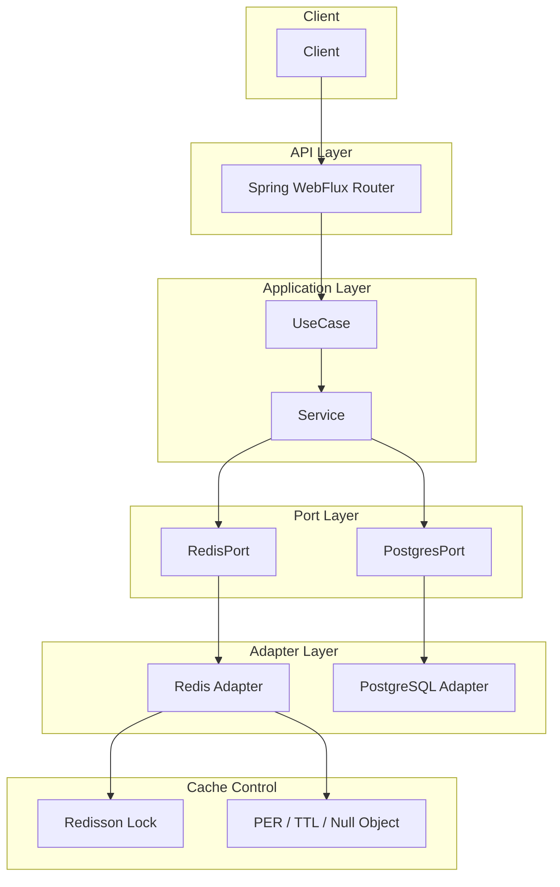

# 📊 Event Tracker

고속 사용자 이벤트 수집과 통계 처리를 위한 **Reactive 기반 이벤트 트래킹 시스템**입니다.  
**Kotlin + Spring WebFlux + Redis + PostgreSQL** 기반 구조로, **최대 1000 RPS**, 평균 응답속도 96ms, CPU 사용률 70% 수준의 고성능 구조를 실현했습니다.

---

## 🧩 프로젝트 개요

이 시스템은 사용자 행동(클릭, 검색, 좋아요 등)을 실시간 수집하고, Redis를 활용한 캐싱 및 통계 처리, PostgreSQL을 통한 정합성 유지로 구성되어 있습니다.  
**Redisson 기반 분산 락**, **PER(Predictive Early Refresh)**, **TTL 제어**, **Fallback 처리** 등 트래픽 최적화 전략을 통해 **캐시 스탬피드와 고부하 상황**에서도 안정적인 성능을 보장합니다.

---

## 🧱 아키텍처 구조



---

## ⚙️ 기술 스택

| 분야        | 기술                                |
|-------------|-------------------------------------|
| Language    | Kotlin 1.9                          |
| Framework   | Spring Boot 3.x, Spring WebFlux     |
| Database    | Redis (캐시/통계), PostgreSQL (영속 저장) |
| Architecture| Hexagonal + Multi-Module            |
| Infra       | Docker, Jib                         |
| Load Test   | Locust                              |

---

## ✅ 주요 기능

### 📥 이벤트 수집 API (`/api/events`)
- 클릭, 검색, 페이지 뷰, 좋아요 이벤트 처리
- 전략 패턴 기반으로 이벤트 타입별 분리된 처리

### ❤️ 좋아요 처리 API (`/api/posts/like`)
- 좋아요/취소 행위 로그 저장
- PostgreSQL의 `post_like` 테이블로 정합성 관리

### 🔍 최근 검색어 저장
- 유저별 Redis List(`LPUSH + LTRIM`)로 저장
- TTL 설정(1시간)으로 오래된 검색어 자동 만료

### 📊 통계 및 캐시
- Redis Sorted Set 기반 실시간 통계
- 인기 키워드 / 인기 게시물 조회
- PostgreSQL 기반 정밀 랭킹 처리

---

## 🧪 성능 테스트 결과 (Locust)

### 📈 500 Users (5분간)

| 항목             | 수치             |
|------------------|------------------|
| 평균 TPS         | **500**          |
| 평균 응답시간    | **63ms**         |
| 95% 응답시간     | 82~93ms          |
| 실패율           | 0%               |
| CPU 사용률       | 약 **40%**       |

### 📈 1000 Users (5분간)

| 항목             | 수치             |
|------------------|------------------|
| 평균 TPS         | **1000**         |
| 평균 응답시간    | **96ms**         |
| 95% 응답시간     | 180~220ms        |
| 실패율           | 0%               |
| CPU 사용률       | 약 **70%**       |

**테스트 환경:** MacBook Air M1 기준

---

## 🔐 트래픽 최적화 전략

| 전략 | 설명 |
|------|------|
| ✅ Redis TTL + 지터 | TTL 만료 시간 분산으로 스탬피드 완화 |
| ✅ PER (Predictive Early Refresh) | TTL 임박 시 미리 캐시 갱신 |
| ✅ Redisson Lock | 캐시 미스 시 DB 접근 |
| ✅ Null Object 캐시 | DB 결과가 없는 경우에도 null 캐시 처리 |

---

## ⚡ 병목 대응 전략

- **Redis 스탬피드** → Redisson 락 + PER + TTL 지터
- **DB 과부하** → 임시 캐시 Hit + Fallback 처리
- **Fallback 시 빈 응답 방지** → 락 실패 시에도 DB 응답 보장
- **CPU 병목** → Netty Worker 수 튜닝, 커넥션 풀 최적화

---

## 🔄 향후 확장 계획

| 기능                             | 상태  |
|----------------------------------|--------|
| Kafka 연동 (TTL 이후 이벤트 저장) | 🔜 예정 |
| Elasticsearch 연동 (검색 최적화) | 🔜 예정 |
| Prometheus + Grafana 모니터링     | 🔜 예정 |

---

## 📁 실행 방법

```bash
# 빌드 및 실행
./gradlew clean build jibDockerBuild
docker-compose up -d
```